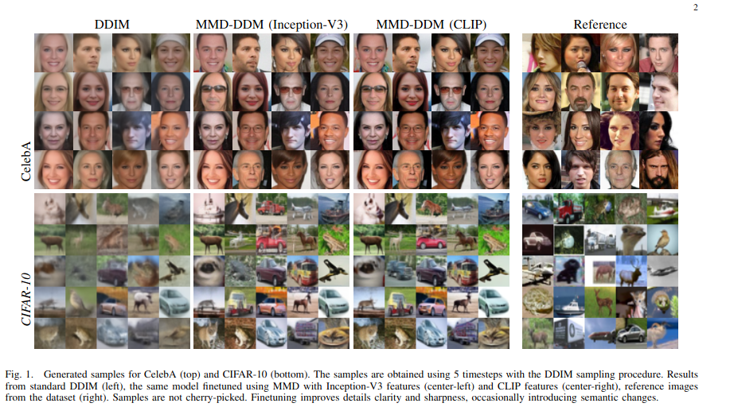
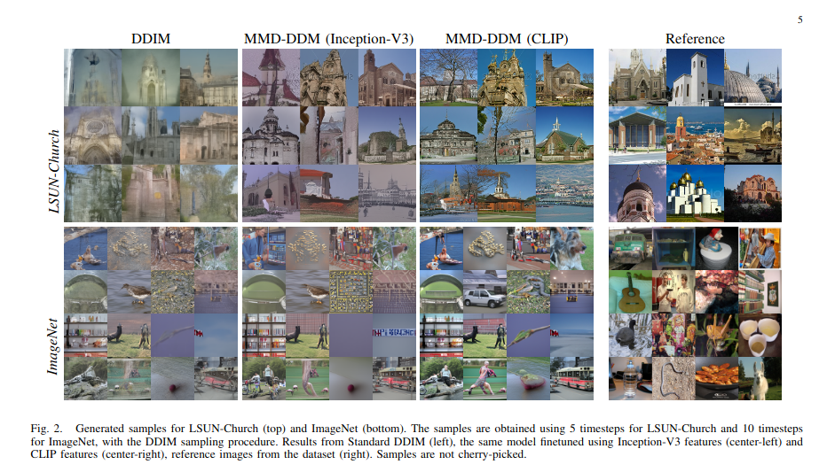

[](https://arxiv.org/abs/2301.07969)

# <p align='center'> MMD-DDM </p>
## <p align='center'>Fast Inference in Denoising Diffusion Models via MMD Finetuning</p>
</div>
<div align="center">
  
  
</div><br/>

## Introduction 
Denoising Diffusion Models (DDMs) have become a popular tool for generating high-quality samples from complex data distributions. These models are able to capture sophisticated patterns and structures in the data, and can generate samples that are highly diverse and representative of the underlying distribution. However, one of the main limitations of diffusion models is the complexity of sample generation, since a large number of inference timesteps is required to faithfully capture the data distribution. In this paper, we present MMD-DDM, a novel method for fast sampling of diffusion models. Our approach is based on the idea of using the Maximum Mean Discrepancy (MMD) to finetune the learned distribution with a given budget of timesteps. This allows the finetuned model to significantly improve the speed-quality trade-off, by substantially increasing fidelity in inference regimes with few steps or, equivalently, by reducing the required number of steps to reach a target fidelity, thus paving the way for a more practical adoption of diffusion models in a wide range of applications.

## Citation
If you find MMD-DDM helpful in your research, please consider citing: 
```bibtex
@misc{https://doi.org/10.48550/arxiv.2301.07969,
  doi = {10.48550/ARXIV.2301.07969},
  url = {https://arxiv.org/abs/2301.07969},
  author = {Aiello, Emanuele and Valsesia, Diego and Magli, Enrico},
  title = {Fast Inference in Denoising Diffusion Models via MMD Finetuning},
  publisher = {arXiv},
  year = {2023},
  copyright = {Creative Commons Attribution 4.0 International}
}
```

## Contact 
If you have any questions, feel free to open an issue or contact us at emanuele.aiello@polito.it

<br><br>
<p align="center">:construction: :pick: :hammer_and_wrench: :construction_worker:</p>
<p align="center">Code and pretrained models will be released soon!</p>
